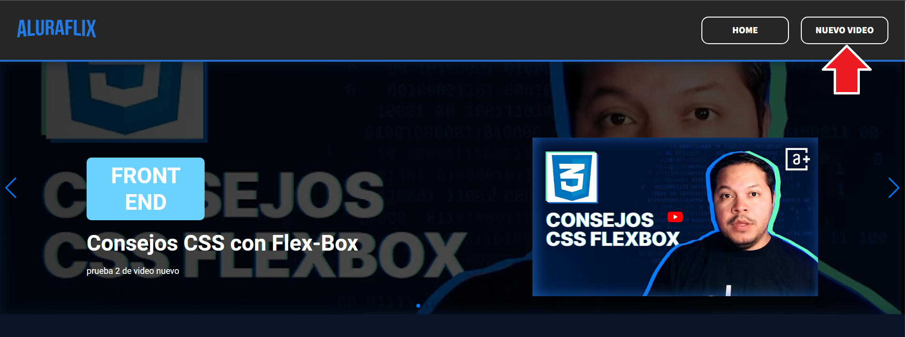
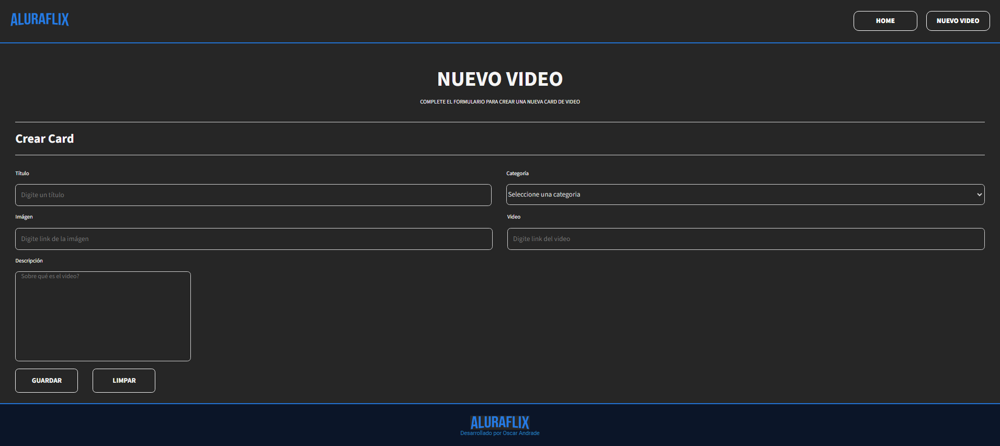
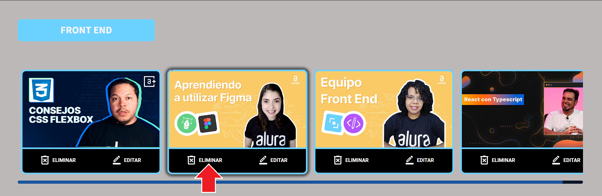
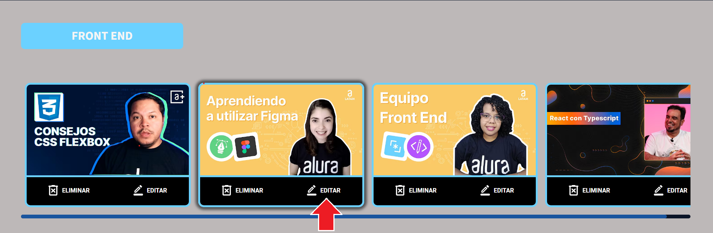
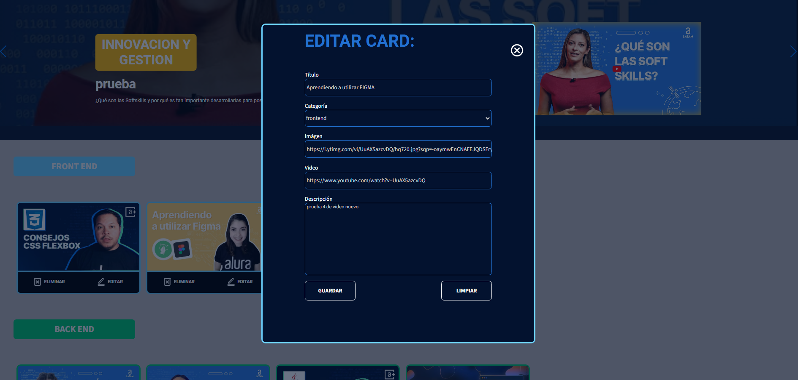

# Challenge ONE-ORACLE

<p align="center" >
     
</p>

# <h1 align="center"><strong>¡AluraFlix Oscar Andrade!</strong></h1> 
---

## Descripción del proyecto📋

Aluraflix es una plataforma diseñada para gestionar vídeos, con funcionalidades como listar, registrar, actualizar y eliminar videos, implementando React con JavaScript. Se usa en ésta librería, tales como componentización, uso de hooks, consumo de API, rutas entre otros. simulando un sitio de streaming con videos del canal Alura de Youtube, organizados por categorías(FronteEnd, BackEnd, Innovación y Gestión).


## Modo de uso📌

### Cargar Proyecto y Base de datos **json-server**

Para cargar el proyecto de react y la base de datos de json-server de manera local, debe ejecutar en una terminal los siguientes comandos uno a uno, y así podrá visualizar en pantalla la página y los videos rederizados:

>```
> npm start
> json-server --watch db.json --port 3001
>```

Sin embargo, en este link podrá visualizar en linea el demo del proyecto:

https://alura-flix-oscar.vercel.app/

---
### Agregar un video

En el Header de la página parte derecha tenemos un botón de Nuevo video que dirige a una nueva pagina donde tenemos un formulario con varios campos requeridos para la creación e ingreso de un video con *Título*, *Categoría*, *Imágen*, *Video* y *Descripción* y al dar click al botón `Guardar`, se cargará el nuevo video y se redireccionará a la página Home donde podrá verse el video en la categoría seleccionada.





### Eliminar un video

En la parte inferior izquierda de la tarjeta del video, se podrá ver el icono de  que seleccionado eliminará automáticamente el video.



### Editar un video

En la parte inferior derecha de la tarjeta del video, se podrá ver el icono de  que seleccionado abrirá el modal automáticamente que mostrará un formulario con toda la información dispuesta para corregir.





## Modo Responsivo🔍

Para dispositivos móvil hasta `600px`, tablet entre `600px a 1024px` y desktop mayores a `1024px`.

---
## Tecnologías utilizadas💡

- 
- 
- 
- 
- 
- 
---
## Desarrollador del Proyecto👨‍💻

<h1 align="center"><strong>Oscar Eduardo Andrade Reyes</strong></h1>

<div align="center">
<table>
  <tr>
    <td></td>
    <td></td>
  </tr>
</table>
</div>
